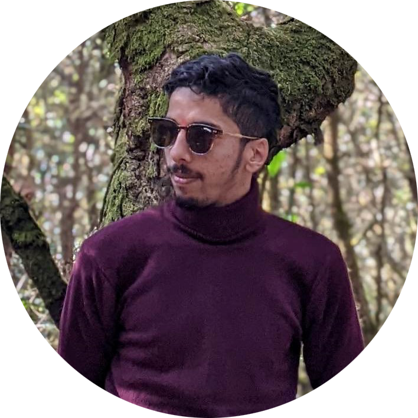

<h1 align="center">Hi, I'm Saroj Prasad Mainali </h1>

<h3 align="center">Quick Learner, Problem Solver, Coding lover.</h3>
</picture>

  

- 🔭 I’m currently working as a Developer at ElytraSolutions and a Freelancer.

- 🌱 I’m currently learning **Machine Learning**

- 📫 How to reach me **sarojprasadmainali@gmail.com**

- ⚡ Fun fact **I understand Programming jokes.**

 

<h2 align="center">Technical Skills:</h2>

<h2 align="center">Familiar Environments:</h2>

<h2 align="center">Soft Skills:</h2>

<h2 align="center">Projects:</h2>

<h2 align="center">Connect with me:</h2>

