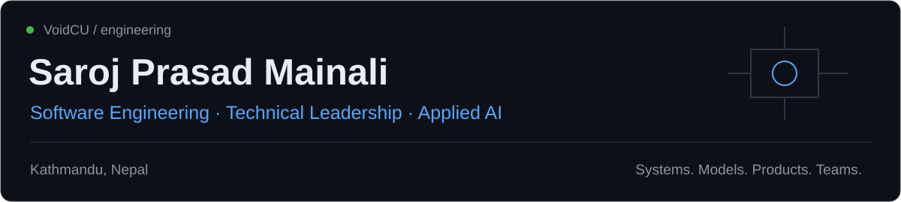

<picture>
  <source media="(prefers-color-scheme: light)" srcset="./assets/engineering-header-light.svg">
  
</picture>

# Hi, I'm Saroj — @VoidCU

**Software Engineer · Technical Lead / CTO · Applied AI & Machine Learning**

I design and build full-stack software, lead engineering teams, and work on AI systems that connect models to useful applications. My experience spans multi-tenant SaaS, web and mobile products, computer vision, audio separation, business automation, and production infrastructure.

Based in **Kathmandu, Nepal**. Computer Engineering graduate of **Thapathali Campus, Tribhuvan University**.

[Portfolio](https://voidcu.com) · [LinkedIn](https://www.linkedin.com/in/saroj-prasad-mainali) · [LeetCode](https://leetcode.com/VoidCU) · [Email](mailto:sarojprasadmainali@gmail.com)

[Engineering](#engineering-focus) · [AI & research](#ai--machine-learning) · [Projects](#selected-projects) · [Stack](#technical-stack) · [Experience](#technical-leadership--experience)

## Currently

- **Lead Developer at Neuron Nest:** multi-tenant EdTech SaaS, access control, business modules, and engineering delivery.
- **Full-Stack Developer & CTO at Elytra Solutions:** web/mobile products, automation, application architecture, and deployment workflows.
- **Technical Head at KS Photography Station:** studio software, high-performance systems, NAS infrastructure, and AI-assisted photo workflows.
- Working across **software architecture, applied AI, product engineering, and team leadership**.

**5+ years** of engineering · **200+ projects** · **150+ repositories** · **10+ companies worked with**

Career totals from my portfolio; the repository total is not a live count of public repositories. Beyond the work: 300+ happy people and friends around the world.

## Engineering focus

| Area | My experience |
| :--- | :--- |
| **Software architecture** | Multi-tenant platforms, modular business systems, APIs, microservices, and role-based access control. |
| **Full-stack development** | React/Next.js interfaces connected to Python and TypeScript backends. |
| **Applied AI** | Computer vision, transformer-based audio separation, NLP, and AI pipelines for operational workflows. |
| **Mobile engineering** | Flutter and React Native applications, including map-based discovery and companion apps. |
| **Delivery & infrastructure** | Containerisation, CI/CD, Kubernetes, deployment automation, and production systems. |
| **Technical leadership** | Architecture decisions, mentoring engineers, coordinating delivery, and translating product needs into software. |

### Systems I've worked on

- **SMS — Student Management System:** student administration for educational institutions.
- **TMS — Ticketing Management System:** software for ticketing operations.
- **Contract Signing System:** digital contract signing within a document workflow.
- **Library Management System:** software supporting library administration.
- **Billing System:** billing software for business operations.
- **Multi-tenant EdTech SaaS:** modular LMS, CRM, and finance capabilities.
- **NGO & donor management:** donor visibility, events, media, and impact tracking.
- **Automation & integrations:** bots, custom ERP modules, and real-time multichannel inboxes.

## AI & machine learning

My AI work covers both model development and the surrounding software: interfaces, APIs, data workflows, and the applications that make a model useful.

### Handwritten Devanagari recognition

A **convolutional neural network** for handwritten Devanagari character recognition, paired with an Android draw-and-predict application.

- **Focus:** image classification and a usable prediction interface.
- **Tools:** TensorFlow, Python, CNNs, Android.
- **Reported result:** 99.98% test accuracy in the project's evaluation context; see the repository for the implementation.

[Recognition project](https://github.com/VoidCU/Handwritten-Devanagari-Character-Recognition) · [Mobile companion repository](https://github.com/VoidCU/handwritten_devanagari_character_recognition)

### Perceparator — audio source separation

A **transformer-based dual-speaker audio separation model**, trained on **LibriMix**. The work explores sequence modelling for isolating speakers from a mixed audio recording.

**PyTorch · Transformers · Python · LibriMix**

[Explore Perceparator](https://github.com/VoidCU/perceparator)

### AI in operational workflows

At KS Photography Station, I implemented an **AI photo-culling pipeline** for daily production workflows. My broader toolkit includes **PyTorch, TensorFlow, scikit-learn, PySpark, Hugging Face, and NLP**.

<strong>Scientific computing & domain modelling</strong>

My engineering work also includes **WEAP scenario modelling**, **SWAT calibration**, and climate simulation workflows for NGO water studies. These projects connect software and data processing to domain-specific modelling questions.

## Selected projects

| Project | What it does | Main technologies |
| :--- | :--- | :--- |
| **[Auctionmandu](https://auctionmandu.com)** | Nepal's bank auction discovery platform: property and vehicle listings, location filters, interactive maps, and mobile apps. | Next.js, React Native, Expo, TypeScript, MapLibre |
| **[Genzlink](https://www.genzlinkapp.com)** | A mobile discovery app for nearby jobs, accommodation, businesses, and used vehicles, with map/list views and saved opportunities. | React Native, Expo, TypeScript, MapLibre |
| **[Amarnepal](https://amarnepal.com)** · [Code](https://github.com/VoidCU/amarnepal) | Civic data about Nepal: budgets, hydropower, history, tourism, and the economy, presented through maps, comparisons, and explainers. | Next.js, React, TypeScript, Tailwind CSS, Framer Motion |
| **[Project Lakhey](https://github.com/VoidCU/project-lakhey)** | NGO and donor management with a donor wall, events, media uploads, authentication, and impact tracking. **In development.** | Next.js, Prisma, Neon Postgres, Cloudinary |
| **[Devanagari OCR](https://github.com/VoidCU/Handwritten-Devanagari-Character-Recognition)** | CNN-based handwritten character recognition with a companion Android application. **Research.** | TensorFlow, Python, Android |
| **[Perceparator](https://github.com/VoidCU/perceparator)** | Transformer-based separation of two speakers from mixed audio. **Research.** | PyTorch, Python, LibriMix |

[Browse repositories](https://github.com/VoidCU?tab=repositories) · [Full project portfolio](https://voidcu.com/projects)

## Technical stack

| Layer | Technologies |
| :--- | :--- |
| **Languages** | Python, TypeScript, JavaScript, SQL, C/C++, Dart |
| **Frontend** | React, Next.js, Tailwind CSS, Framer Motion |
| **Mobile** | React Native, Expo, Flutter |
| **Backend & APIs** | FastAPI, NestJS, Django, Laravel, Node.js, GraphQL |
| **Databases & application data** | PostgreSQL, Neon Postgres, Prisma, Cloudinary |
| **AI / ML / data** | PyTorch, TensorFlow, scikit-learn, PySpark, Hugging Face, NLP |
| **Infrastructure** | Docker, Kubernetes, GitHub Actions, AWS, Vercel, CI/CD |
| **Development environment** | Git, Linux, automation tooling |
| **Design & creative tools** | Figma, Blender, Photoshop, Illustrator |
| **Scientific modelling** | WEAP, SWAT |

<strong>How this connects in my work</strong>

- **EdTech SaaS:** Next.js + FastAPI + PostgreSQL + Kubernetes.
- **Map-based products:** React Native / Expo + TypeScript + MapLibre.
- **Donor management:** Next.js + Prisma + Neon Postgres + Cloudinary.
- **Computer vision:** TensorFlow / Python connected to an Android interface.
- **Audio research:** PyTorch / Transformers trained with LibriMix.
- **Delivery:** Docker and GitHub Actions supporting deployment workflows.

These are combinations used across different projects, not a single architecture shared by every product.

## Technical leadership & experience

### Neuron Nest — Lead Developer

**November 2024–present**

- Architected multi-tenant EdTech SaaS using **FastAPI, Next.js, PostgreSQL, and Kubernetes**, with modular LMS, CRM, and finance capabilities.
- Designed dynamic RBAC, reducing onboarding time by **40%**.
- Mentored **4 engineers** and worked on containerised CI/CD that enabled daily releases.

### Elytra Solutions — Full-Stack Developer & CTO

**December 2022–present**

- Shipped **25+ web/mobile applications** and automation bots.
- Automation work saved approximately **1,500 hours per year**.
- Led a microservice migration; Docker and GitHub Actions cut deployment time by **60%**.

### KS Photography Station — Technical Head

**February 2025–present**

- Maintain studio software and configure high-performance systems and NAS infrastructure.
- Implemented an AI photo-culling pipeline for daily production workflows.

<strong>Consulting & earlier experience</strong>

**Freelance Full-Stack Consultant · March 2024–present**

Responsive websites across Jamstack, WordPress, and Shopify; custom ERP modules; WEAP scenario modelling and SWAT calibration for NGO water studies.

**BloomBytes · Website Designer · February–December 2022**

Crafted responsive UI for EngineersNepal, contributing to a threefold increase in monthly visitors.

[Full experience](https://voidcu.com/experience) · [Companies and collaborators](https://voidcu.com/clients)

## Problem solving & continued learning

**LeetCode: 690 problems solved** — **270 easy · 351 medium · 69 hard**. Global rank **100,376**.

Verified portfolio snapshot: September 12, 2026. [Current LeetCode profile](https://leetcode.com/VoidCU).

**B.E. Computer Engineering** — Thapathali Campus, Tribhuvan University · 2018–2023.

<strong>Courses & certifications</strong>

| Course | Provider | Completed |
| :--- | :--- | :--- |
| Machine Learning Specialization | Coursera / Andrew Ng | March 2023 |
| Advanced Learning Algorithms | Coursera | March 2023 |
| Flutter & Dart Complete Guide | Udemy | 2023 |
| Game Theory | Coursera | May 2023 |
| Understanding Research Methods | Coursera | April 2023 |

## Writing

- [Wearing Many Hats: Projects, Programming, and the Chaos In Between](https://voidcu.com/blog/wearing-many-hats)
- [AI Is Doing to Developers What China Did to Factory Workers](https://voidcu.com/blog/ai-is-the-new-china)
- [The Past, Present, and Death: Three Things That Are Always True](https://voidcu.com/blog/three-truths)

## Connect

I'm interested in **software engineering, technical leadership, applied AI, SaaS platforms, mobile products, and useful automation**. Reach out about a project, a collaboration, or an engineering problem.

**[sarojprasadmainali@gmail.com](mailto:sarojprasadmainali@gmail.com)**

[LinkedIn](https://www.linkedin.com/in/saroj-prasad-mainali) · [Portfolio](https://voidcu.com) · [GitHub repositories](https://github.com/VoidCU?tab=repositories)
